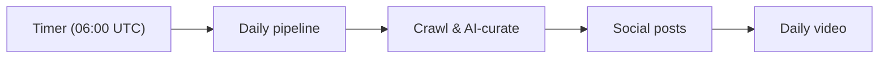

# DevNews Backend

> Serverless C# backend that crawls developer news, curates it with AI, and turns the best stories into LinkedIn posts and a daily short-form video.

DevNews Backend is an Azure Functions app (.NET 10 isolated worker). It ingests RSS feeds, uses Anthropic Claude to summarize, categorize, score, and de-duplicate articles, and stores them in Cosmos DB. A daily [Durable Functions](https://learn.microsoft.com/azure/azure-functions/durable/) pipeline then publishes the top stories as individual LinkedIn posts and renders a single daily video with Creatomate for YouTube and LinkedIn. A small public read API serves the curated news to the frontend.

Part of the **DevNews** product, alongside the web frontend ([`dev-news-frontend`](https://github.com/Steinklo/dev-news-frontend)) and infrastructure-as-code ([`dev-news-iac`](https://github.com/Steinklo/dev-news-iac)).

## How it works

A single orchestrator runs the daily pipeline on a timer (06:00 UTC): crawl and curate news, publish the top stories as social posts, then generate one daily video.



- **Crawl** — discover articles from 22 RSS feeds → Claude (Sonnet) summary, category & relevance score → keep relevance ≥ 50 → AI (Haiku) de-duplication → persist to Cosmos DB.
- **Social posts** — select items scoring 85+ → Claude (Haiku) writes a post per article → publish to LinkedIn with the source link → persist to the `text-posts` container.
- **Daily video** — combine the top items into one script (Haiku) → validate (quality ≥ 70) → Creatomate render (DALL·E backgrounds + Azure TTS) → Azure Blob → publish to YouTube + LinkedIn → persist to `short-videos`.

## Quick start

```bash
dotnet restore DevNews.sln
dotnet build DevNews.sln --configuration Release
dotnet test DevNews.UnitTests/DevNews.UnitTests.csproj
cd DevNews.Functions && func start
```

`func start` serves the API at `http://localhost:7071`. Confirm with `GET http://localhost:7071/api/v1/news/categories`. Local runs need a storage backend — Azurite or a real storage account — for Durable Functions.

## API

Public read endpoints are anonymous and rate-limited to **60 requests/min per IP**. Pipeline triggers require a Function key.

| Method | Route | Auth |
|--------|-------|------|
| `GET` | `/api/v1/news/categories` | Anonymous |
| `GET` | `/api/v1/news/{id}` | Anonymous |
| `GET` | `/api/v1/news/category/{category}?year_month=YYYY-MM&limit=N` | Anonymous |
| `POST` / `GET` | `/api/v1/pipeline/start` · `/pipeline/status/{instanceId}` | Function key |
| `POST` / `GET` | `/api/v1/crawl/start` · `/crawl/status/{instanceId}` | Function key |
| `POST` / `GET` | `/api/v1/social-posts/generate` · `/social-posts/status/{instanceId}` | Function key |
| `POST` / `GET` | `/api/v1/video-generation/start` · `/video-generation/status/{instanceId}` | Function key |

`limit` defaults to 50 (max 100); `year_month` defaults to the current month. `social-posts/generate` runs the social-post + daily-video stage; `video-generation/start` is the legacy per-article video path. Categories: AI Models & APIs, AI Developer Tools, Agents & Frameworks, AI Engineering, AI Safety & Security.

## Prerequisites & configuration

| Requirement | Notes |
|---|---|
| .NET 10 SDK | Build and test |
| Azure Functions Core Tools v4 | `func start` for local runs |
| Azurite (or a storage account) | Required by Durable Functions locally |
| Cosmos DB + Anthropic API key | Minimum to exercise the read API and crawl |

Set configuration in `local.settings.json` locally (gitignored) or in Azure App Settings / Key Vault when deployed — **never commit secrets**. Core keys: `CosmosDbEndpoint`, `CosmosDbKey`, `AnthropicApiKey`, `AzureStorageConnectionString`. Video and publishing add `CreatomateApiKey`, `VideoGeneration:TtsVoiceName`, `YouTubeClientId` / `YouTubeClientSecret` / `YouTubeRefreshToken`, `LinkedInAccessToken`, `VideoGeneration:LinkedInOrganizationId`, and `DailyPipelineSchedule`.

## Links

- Frontend — [`dev-news-frontend`](https://github.com/Steinklo/dev-news-frontend) · live at [dev-news.dev](https://dev-news.dev)
- Infrastructure — [`dev-news-iac`](https://github.com/Steinklo/dev-news-iac)
- Dev API (example): `https://func-devnews-api-dev.azurewebsites.net/api/v1`

## Contributing

Branch off `main` and open a PR; GitHub Actions runs build + tests. Merges to `main` auto-deploy to dev; production is a manual workflow dispatch.

## License

Released under the [MIT License](LICENSE).
