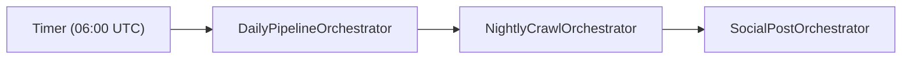
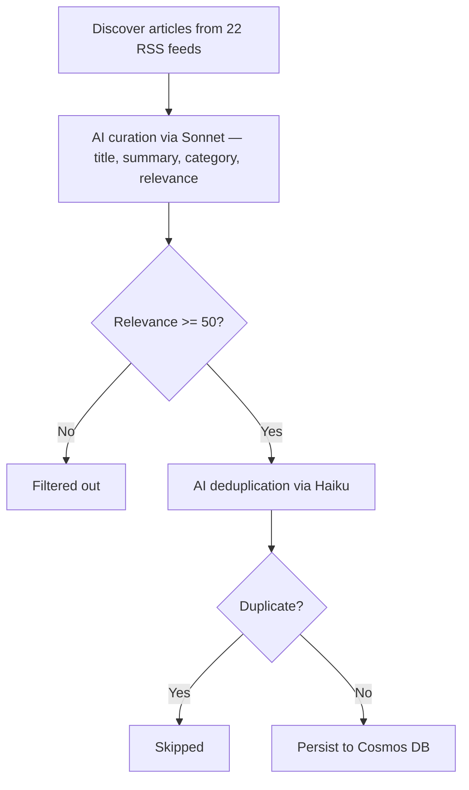
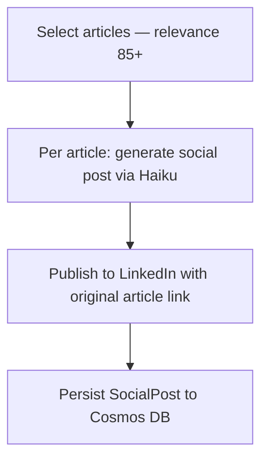
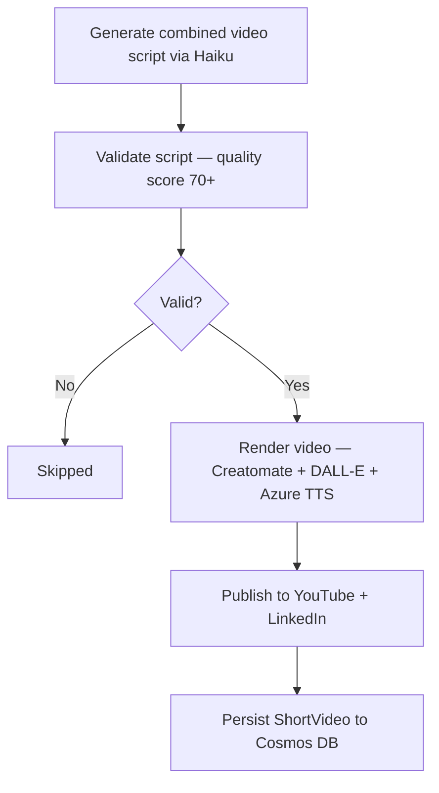
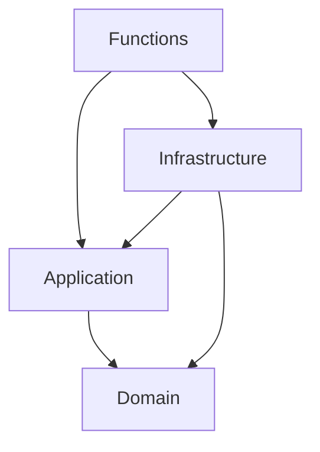

# DevNews Backend

Serverless C# backend for an AI-powered developer news aggregator. Automatically crawls, curates, and publishes developer news — with social media posts and daily video summaries.

Built with Azure Functions V4 (.NET 10), Cosmos DB, Anthropic Claude AI, and Creatomate.

## Daily Pipeline



### Step 1: News Crawl

Discovers and curates articles from 22 RSS feeds (up to 3 articles per feed).



### Step 2: Social Media Posts

Generates and publishes individual posts for top articles (relevance >= 85).



### Step 3: Daily Video

Generates a single daily video summarizing top articles. Requires Creatomate API key.



## Architecture

Clean Architecture with Domain-Driven Design (DDD).



## API Endpoints

| Method | Route | Description |
|--------|-------|-------------|
| `GET` | `/api/v1/news/categories` | List all categories |
| `GET` | `/api/v1/news/{id}` | Single news item by ID |
| `GET` | `/api/v1/news/category/{category}?year_month=YYYY-MM&limit=N` | News by category |
| `POST` | `/api/v1/pipeline/start` | Trigger full daily pipeline |
| `GET` | `/api/v1/pipeline/status/{instanceId}` | Pipeline status |
| `POST` | `/api/v1/crawl/start` | Trigger crawl only |
| `GET` | `/api/v1/crawl/status/{instanceId}` | Crawl status |
| `POST` | `/api/v1/social-posts/generate` | Trigger social posts + video |
| `GET` | `/api/v1/social-posts/status/{instanceId}` | Social post generation status |
| `POST` | `/api/v1/video-generation/start` | Trigger per-article video (legacy) |
| `GET` | `/api/v1/video-generation/status/{instanceId}` | Video generation status |

## Categories

1. AI Models & APIs
2. AI Developer Tools
3. Agents & Frameworks
4. AI Engineering
5. AI Safety & Security

## Getting Started

```bash
dotnet restore DevNews.sln
dotnet build DevNews.sln --configuration Release
dotnet test DevNews.UnitTests/DevNews.UnitTests.csproj
cd DevNews.Functions && func start
```

### Configuration

Set in `local.settings.json` (local) or Azure App Settings (deployed):

| Key | Description | Required |
|-----|-------------|----------|
| `CosmosDbEndpoint` | Cosmos DB endpoint URL | Yes |
| `CosmosDbKey` | Cosmos DB access key | Yes |
| `AnthropicApiKey` | Claude AI API key | Yes |
| `AzureStorageConnectionString` | Azure Blob Storage connection string | Yes |
| `LinkedInAccessToken` | LinkedIn API access token | For social posts |
| `VideoGeneration:LinkedInOrganizationId` | LinkedIn company page ID | For social posts |
| `CreatomateApiKey` | Creatomate video rendering API key | For video |
| `VideoGeneration:TtsVoiceName` | Azure TTS voice (default: `en-US-AndrewMultilingualNeural`) | No |
| `YouTubeClientId` | YouTube OAuth client ID | For video |
| `YouTubeClientSecret` | YouTube OAuth client secret | For video |
| `YouTubeRefreshToken` | YouTube OAuth refresh token | For video |
| `DailyPipelineSchedule` | Cron expression (e.g. `0 0 6 * * *`) | No |

### Incremental activation

1. **Core (required keys only):** Crawl + curate + persist to website
2. **Add LinkedIn secrets:** Social media posts start publishing
3. **Add Creatomate + YouTube secrets:** Daily video generation starts

## CI/CD

- **PR builds**: Build + test validation
- **Push to main**: Build, test, deploy to dev (automatic)
- **Prod deploy**: Manual trigger via GitHub Actions

## Tech Stack

- **.NET 10** — Azure Functions V4 isolated worker
- **Cosmos DB** — Document storage (serverless)
- **Anthropic Claude** — Sonnet for curation, Haiku for dedup/scripts/posts
- **Creatomate** — Programmatic video rendering with DALL-E backgrounds and Azure TTS
- **Azure Blob Storage** — Video and thumbnail assets
- **Durable Functions** — Orchestration with retry policies and fan-out
- **Mediator** — Source-generated CQRS
- **FluentValidation** — Input validation
- **xUnit** — Unit testing
